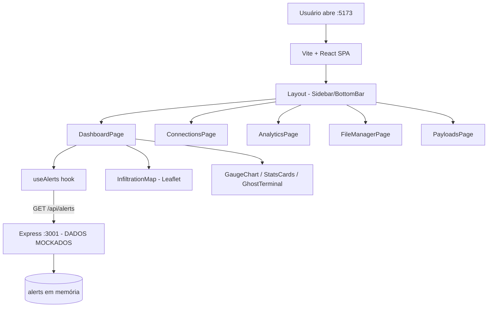

# 👻 GhostRat_MONITOR — Dashboard de Monitoramento (UI Demo)

<p align="center">
  
  <a href="https://github.com/panda12332145/GhostRat_MONITOR/commits/main"></a>
  <a href="https://github.com/panda12332145/GhostRat_MONITOR"></a>
  
  
  
</p>

---

## ⚠️ Importante

> **UI DEMO / projeto acadêmico.** Este repositório contém **apenas uma interface de monitoramento com dados simulados (mock)** — o backend entrega alertas fictícios e **não existe nenhum componente ofensivo, C2 real ou coleta de dados**. Serve para estudo de dashboards, visualização de eventos e boas práticas de UI. Todos os dados exibidos são inventados.

---

## 🔖 Resumo

**GhostRat_MONITOR** é um dashboard em React + TypeScript que simula um painel de monitoramento de "nós" conectados: gauge de CPU, mapa de infiltração (Leaflet), terminal fictício, cartões de estatísticas, sistema de alertas e páginas de conexões/analytics/arquivos/payloads. Um servidor Express fornece os alertas mockados na porta 3001.

### ✨ Funcionalidades Principais

- ✅ **Dashboard** — GaugeChart, StatsCards, GhostTerminal, InfiltrationMap e SystemAlerts
- ✅ **Mapa interativo** — Leaflet/React-Leaflet com marcadores dos "nós"
- ✅ **Sistema de alertas** — hook `useAlerts` consumindo `GET /api/alerts` (mock)
- ✅ **Páginas modulares** — Dashboard, Connections, Analytics, FileManager, Payloads
- ✅ **Layout completo** — Sidebar + BottomBar + StatusBadge reutilizáveis
- ✅ **Scripts de start multiplataforma** — `start-dev.bat` (Windows) e `start-dev.py` (cross-platform)

---

## 📽 Demonstração

```text
$ npm run dev:all

[1] backend Express :3001  → GET /api/alerts
[2] frontend Vite    :5173 → Dashboard

GET /api/alerts →
{
  "success": true,
  "data": [
    { "id": "ALT-001", "title": "NODE_DISCONNECTED", "severity": "warning", ... },
    { "id": "ALT-002", "title": "NEW_INFILTRATION",  "severity": "success", ... },
    { "id": "ALT-003", "title": "UPDATE_AVAIL",      "severity": "critical", ... }
  ]
}
```

---

## ⚙️ Explicação das Partes Importantes

### Backend mock (`server.js`)
```javascript
let alerts = [ /* dados fictícios de exemplo */ ];
app.get('/api/alerts', (req, res) => {
  const activeAlerts = alerts.filter(a => !dismissedAlerts.has(a.id));
  res.json({ success: true, data: activeAlerts, count: activeAlerts.length });
});
```
> API mínima em Express com CORS restrito ao dev server. `POST /api/alerts/:id/dismiss` descarta alerta temporariamente (janela de 5s).

### Hook de alertas (`src/hooks/useAlerts.ts`)
```typescript
// consome GET /api/alerts e expõe estado reativo para a UI
```
> Isolamento da camada de dados: a UI nunca depende de mocks hardcoded.

### Mapa (`src/components/Dashboard/InfiltrationMap.tsx`)
```tsx
<MapContainer> ... <Marker position={[-23.55, -46.63]} /> ... </MapContainer>
```
> Visualização geográfica dos nós com `react-leaflet`.

### Layout (`src/components/Layout/`)
- `Sidebar.tsx` — navegação entre páginas
- `BottomBar.tsx` — status bar
- `StatusBadge.tsx` — indicadores de estado

---

## 🔄 Fluxo de Trabalho / Arquitetura



---

## 📂 Estrutura do Projeto

```plaintext
GhostRat_MONITOR/
├── server.js                # API Express mock (:3001)
├── START-SCRIPTS-README.md   # Docs dos scripts de start
├── start-dev.bat             # Start Windows (2 janelas)
├── start-dev.py              # Start cross-platform
├── index.html
├── package.json              # React 19, Leaflet, Express, concurrently
├── vite.config.ts
├── src/
│   ├── App.tsx main.tsx
│   ├── pages/
│   │   ├── DashboardPage.tsx
│   │   ├── ConnectionsPage.tsx
│   │   ├── AnalyticsPage.tsx
│   │   ├── FileManagerPage.tsx
│   │   └── PayloadsPage.tsx
│   ├── components/
│   │   ├── Dashboard/  (GaugeChart, GhostTerminal, InfiltrationMap, StatsCards, SystemAlerts)
│   │   ├── Connections/ (ConnectionCard)
│   │   ├── Layout/     (Sidebar, BottomBar, Layout)
│   │   └── common/     (StatusBadge)
│   ├── hooks/useAlerts.ts
│   ├── data/ (connections.ts, systemData.ts)
│   └── utils/ (cn.ts, dateFormatter.ts, storageManager.ts)
└── tests/ (test.html)
```

---

## 🛠️ Tecnologias

| Camada | Stack |
|---|---|
| Frontend | React 19 · TypeScript · Vite · Tailwind CSS 4 · react-leaflet |
| Backend | Node.js · Express · CORS |
| Dev Tools | concurrently · scripts .bat/.py |

---

## ▶️ Instalação

```bash
git clone https://github.com/panda12332145/GhostRat_MONITOR.git
cd GhostRat_MONITOR
npm install
```

---

## 🚀 Execução

```bash
npm run dev:all      # backend + frontend juntos
# ou manualmente:
npm run dev:server   # Express :3001
npm run dev          # Vite :5173

# Windows:
.\start-dev.bat
# Multiplataforma:
python start-dev.py
```

---

## ⚠️ Limitações

- Dados 100% simulados — nenhum backend real de monitoramento
- Alertas em memória (reset a cada restart)
- Páginas FileManager/Payloads são UI sem ação real

---

## 🚀 Roadmap

- [x] Dashboard com mapa, gauges e alertas
- [x] Backend mock com API REST mínima
- [x] Scripts de start cross-platform
- [ ] Conectar a fonte de dados real ( quando houver )
- [ ] Testes de componentes (vitest)
- [ ] Autenticação

---

## 📄 Licença

MIT License.

---

## 👾 Autor

<p align="center">
  
</p>

<p align="center">Feito por <strong>Panda12332145</strong> 👋🏽</p>

---

## 🧑‍💻 Sobre Mim

Sou apaixonado por **Física Teórica, Cibersegurança e Desenvolvimento de Sistemas**. Tenho grande interesse em programação de baixo nível, engenharia reversa, automação, sistemas Windows, criptografia e segurança ofensiva. Também gosto bastante de música, filosofia e computação avançada.

---

## 🌐 Redes

* **Site:** [https://panda-h0me.netlify.app/](https://panda-h0me.netlify.app/)
* **YouTube:** [https://www.youtube.com/@X86BinaryGhost](https://www.youtube.com/@X86BinaryGhost)
* **Instagram:** [https://www.instagram.com/01pandal10/](https://www.instagram.com/01pandal10/)
* **GitHub:** [https://github.com/panda12332145](https://github.com/panda12332145)
* **LinkedIn:** [linkedin.com/in/athos-da-boanergis](https://www.linkedin.com/in/athos-d%C3%A3-boanergis-5585a4288/)

---

## 🚀 Áreas de Interesse

* **Cibersegurança Avançada** 🔒
* **Hacking & Engenharia Reversa** 💻
* **Computação de Baixo Nível** 🖥️
* **Matemática e Física Teórica** 📐⚛️
* **Desenvolvimento de Ferramentas de Segurança** 🛠️

_"Conhecimento é poder, e domínio técnico vem da compreensão profunda dos sistemas."_

---

## 📞 Contato & Suporte

Para colaborações, dúvidas ou sugestões:

📧 **E-mail:** [athos.cybersec@gmail.com](mailto:athos.cybersec@gmail.com)

🐛 **Reportar Bug:** [Abrir Issue](https://github.com/panda12332145/GhostRat_MONITOR/issues)

💡 **Sugerir Melhoria:** [Discussions](https://github.com/panda12332145/GhostRat_MONITOR/discussions)

## 📊 Métricas

<!-- metrics:start -->
| Métrica | Valor |
|---|---|
| ⭐ Stars | 0 |
| 🍴 Forks | 0 |
| 📌 Issues abertas | 0 |
| 🕐 Último commit | 2026-09-29 |
<!-- metrics:end -->
